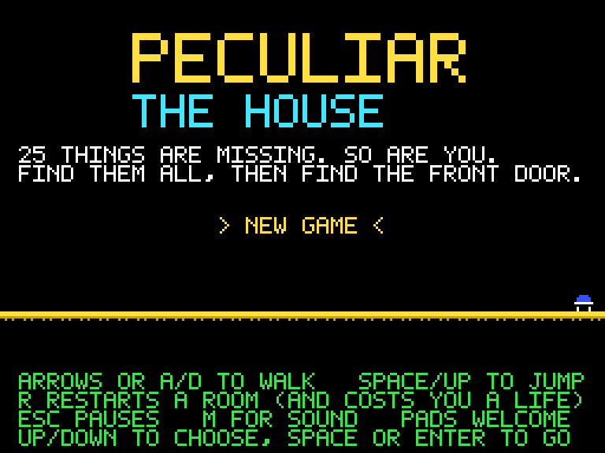
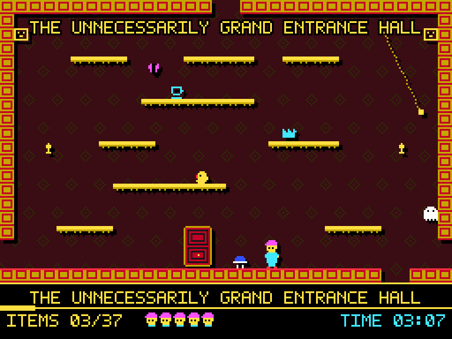
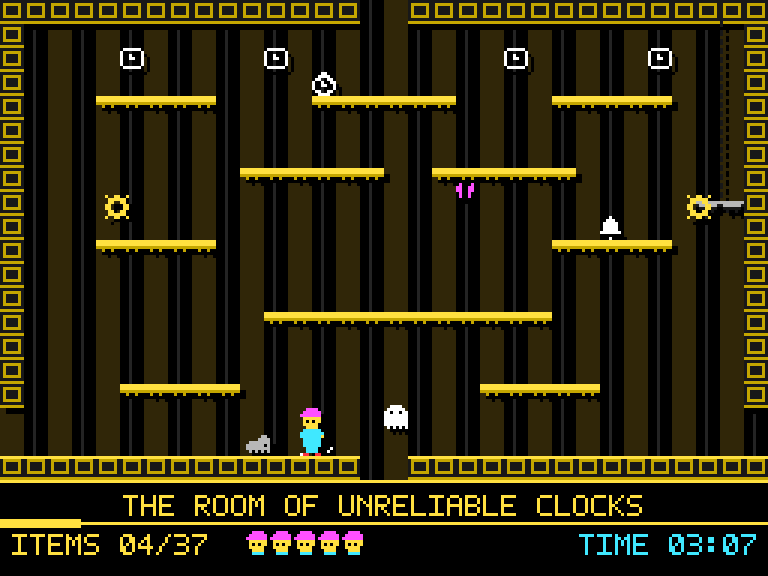
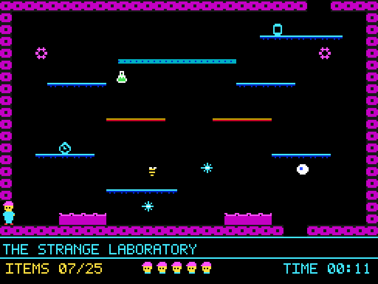
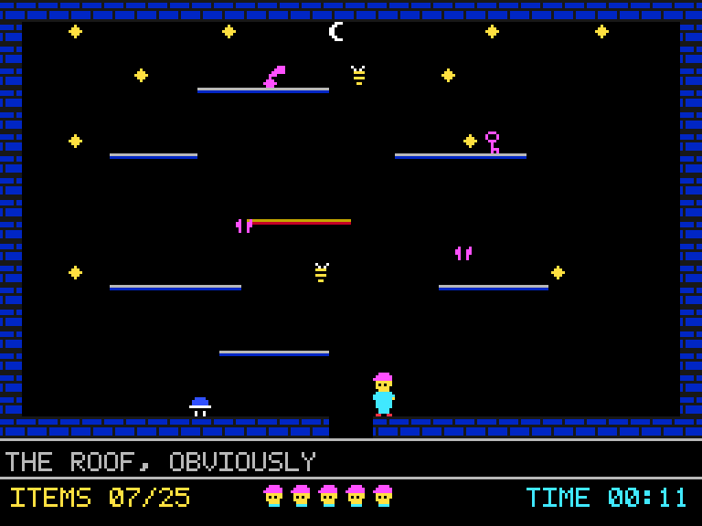
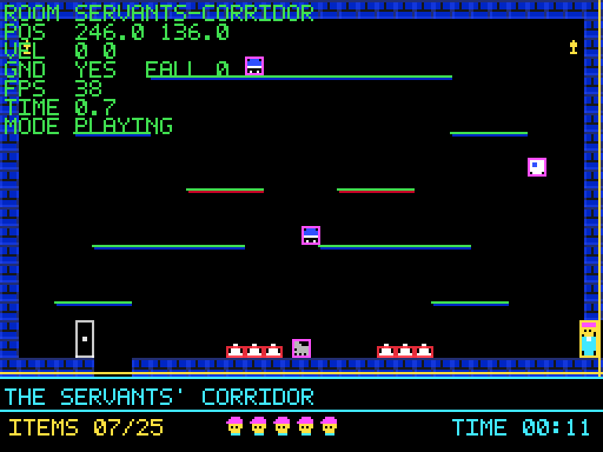

# The Peculiar House

An original single-screen platform game, written as if by an ambitious 1980s
bedroom programmer who had somehow got hold of TypeScript.

You are trapped in a large, eccentric, mildly unreasonable mansion. Twenty-five
objects are scattered through its fourteen rooms. Find all of them, then find
the front door, which will not open until you have.

The game is inspired by the _shape_ of early-1980s British 8-bit platform games:
single-screen rooms that join up into one interconnected house, precise jumps,
strange and entirely predictable enemies, flashing collectables, and a status
panel along the bottom. Everything in it — the code, the artwork, the room
layouts, the characters, the sounds and the jokes — is original to this project.
No assets from any commercial game are used, copied, or derived from.

---

## Screenshots

|                                                                      |                                                                                 |
| -------------------------------------------------------------------- | ------------------------------------------------------------------------------- |
|                        |  |
| _The title screen_                                                   | _The Unnecessarily Grand Entrance Hall, where you start and, eventually, leave_ |
|  |                    |
| _The Room Of Unreliable Clocks, with its swinging cogs_              | _The Strange Laboratory: conveyors, crumbling floors and something in a flask_  |
|                  |                                |
| _The Roof, Obviously_                                                | _Debug mode, showing collision boxes, hazard rectangles, spawns and exits_      |

---

## Running with Docker

```bash
docker compose up --build
```

Then open **<http://localhost:8088>**.

If that port is busy, override it:

```bash
PECULIAR_PORT=9000 docker compose up --build
```

To stop it:

```bash
docker compose down
```

The build is two stages. The first uses `node:24-alpine` to install
dependencies, type-check and bundle. The second copies only the built `dist/`
into `nginx:1.29-alpine`. The image that actually runs contains no Node, no npm,
no source and no `node_modules` — just static files and nginx, at around 63 MB.
There is a health check on `/healthz`, which `docker compose ps` reports as
`healthy` once nginx is answering.

---

## Development

Node 22.12 or newer.

```bash
npm install
npm run dev
```

Then open <http://localhost:5173>. Vite hot-reloads as you edit.

### npm scripts

| Script                 | What it does                                              |
| ---------------------- | --------------------------------------------------------- |
| `npm run dev`          | Vite dev server with hot reload on port 5173              |
| `npm run build`        | Type-check, then bundle to `dist/`                        |
| `npm run preview`      | Serve the built `dist/` on port 4173                      |
| `npm run typecheck`    | `tsc --noEmit` in strict mode                             |
| `npm run lint`         | ESLint, zero warnings tolerated                           |
| `npm run lint:fix`     | ESLint with `--fix`                                       |
| `npm run format`       | Prettier, writing changes                                 |
| `npm run format:check` | Prettier, checking only                                   |
| `npm test`             | Vitest, one run                                           |
| `npm run test:watch`   | Vitest in watch mode                                      |
| `npm run verify`       | Type-check, lint, test and build — everything CI would do |

---

## Controls

| Action                   | Keyboard                    | Gamepad                    |
| ------------------------ | --------------------------- | -------------------------- |
| Walk left                | `←` or `A`                  | D-pad left, or left stick  |
| Walk right               | `→` or `D`                  | D-pad right, or left stick |
| Jump                     | `Space`, `↑` or `W`         | A / B, or D-pad up         |
| Restart the current room | `R` — **this costs a life** | X                          |
| Pause                    | `Esc` or `P`                | Start                      |
| Sound on/off             | `M`                         | —                          |
| Choose a menu option     | `↑` / `↓`                   | D-pad up/down              |
| Confirm                  | `Space` or `Enter`          | A, or Start                |

Notes on how it feels, all of which are deliberate:

- **Jumps are a fixed height.** Letting go of the button early does not shorten
  them. Every gap in the house is therefore exactly as wide as it looks.
- **There is no acceleration and no momentum.** Releasing the direction key
  stops you dead. You never slide, bounce or rotate.
- **You can steer in mid-air.** The games of the era mostly would not let you.
  They were wrong.
- **A jump clears four tiles (32 px) but not five.** The whole house is laid out
  around that number, and there is a test that pins it.
- **Falling too far is fatal** — more than 72 px without landing. A fall that
  carries you down into the room below keeps counting.
- `R` costs a life on purpose: it is the way out of a spot you cannot escape,
  not a free retry.

---

## Architecture

```
src/
  main.ts                  Phaser game config and integer scaling
  config.ts                Every tunable number in the game

  scenes/
    BootScene.ts           Draws every texture, then hands over
    TitleScene.ts          Title, menu, Continue / New Game
    GameScene.ts           The game: sequencing and presentation
    GameOverScene.ts       Out of lives
    VictoryScene.ts        Out of the house

  objects/
    Player.ts              Movement model (no Phaser)
    Enemy.ts               Enemy motion as a pure function of time (no Phaser)

  world/
    tiles.ts               What each tile character means (no Phaser)
    roomTypes.ts           Room data schema and per-room validation (no Phaser)
    Room.ts                One room, plus its crumbling floors (no Phaser)
    RoomManager.ts         Loads every room JSON, validates the whole house

  systems/
    CollisionSystem.ts     Swept AABB against the tile grid (no Phaser)
    InputSystem.ts         Keyboard and gamepad, straight from the browser
    AudioSystem.ts         Square waves generated at runtime
    SaveSystem.ts          localStorage, defensively

  state/
    GameState.ts           Room, lives, collected items, clock

  render/
    pixels.ts              Plot art strings onto a canvas
    textures.ts            Build every texture at boot
    PixelText.ts           Text in the project's own typeface

  ui/
    Hud.ts                 The status panel
    DebugOverlay.ts        Collision boxes and numbers, when asked for

  assets/
    palette.ts             Sixteen colours and black
    font.ts                An original 5x7 typeface
    sprites.ts             Player, enemies, collectables, the door
    tileArt.ts             Walls, ledges, decoration, hazards
    themes.ts              Which shapes and colours each kind of room uses

  data/rooms/*.json        The house itself
```

### Phaser's job, and everyone else's

Phaser draws things and runs the loop. It does not decide anything.

All the rules — movement, collision, enemy paths, room structure, game state,
saving — live in modules that import no Phaser at all. That is why 251 tests can
run in a plain Node environment with no canvas and no WebGL, and it is why
`GameScene` is mostly sequencing rather than logic.

Arcade Physics is deliberately not used. The movement controller in
`objects/Player.ts` sets velocities rather than accumulating forces, which is
what makes the jumps repeatable to the pixel.

### The simulation loop

`GameScene.update()` accumulates real time and steps the simulation in fixed
1/60 s slices (at most five per rendered frame). Everything that affects the
game happens inside a fixed step; everything outside one only draws. A slow
frame therefore changes nothing about how the game plays.

### Rooms and the RoomManager

`RoomManager` picks up every file in `src/data/rooms/` with `import.meta.glob`
and wraps each in a `Room`. There is no registry and no list of rooms in the
code: adding a file adds a room.

A `Room` is the JSON plus the only thing about a room that changes while you are
in it — which crumbling floors have gone. It implements the `TileGrid` interface
that the collision system needs, so collision never sees a room at all, only
`solidAt`, `platformAt` and `hazardAt`.

Rooms are laid out on a grid (`grid: {x, y}`) which acts as the map of the
house. Exits must be reciprocal and must agree with that grid, and there are
tests for both.

### The collision system

`systems/CollisionSystem.ts` resolves one axis at a time, X first, against 8×8
cells:

- A **solid** tile blocks from all four sides.
- A **platform** tile blocks downward movement only, and only if the body's
  underside was at or above the tile's surface before the step. You jump
  straight up through it.
- Sweeps check the whole path travelled, not just the destination, so nothing
  can tunnel through a wall however fast it is moving.
- Only cells the body was genuinely clear of can block it, so a body that has
  somehow ended up inside a wall is nudged out rather than flung across the room.
- Hazards are tested against a sub-rectangle of the cell — floor spikes only
  occupy the bottom five pixels — using a player hitbox inset by one pixel on
  every side. Deaths should always look deserved.

### Enemies

An enemy's position is a **pure function of how long you have been in the room**:

```ts
enemyPosition(def, seconds, spriteSize) -> { x, y }
```

There is no per-enemy state anywhere. Entering a room, or dying and respawning,
resets the room clock to zero and every resident snaps back to exactly where it
started. That is what made the enemies in these games learnable, and learnable
is the whole game.

Five behaviours: `patrol-h`, `patrol-v`, `circle`, `pendulum` and `static`.

### Game state

```ts
interface GameState {
  currentRoom: string;
  lives: number;
  collectedItems: Set<string>;
  startedAt: number; // elapsedMs is derived from this
  entrySpawn: SpawnKey; // where a death sends you back to
  deaths: number;
}
```

One object, held by `GameScene`, untouched by room changes. Collected items are
global and keyed by id, so an item stays collected when you come back.

`entrySpawn` records the edge you came in through, so dying returns you to where
you entered the room rather than to some fixed point.

### Saving

`SaveSystem` writes a snapshot to `localStorage` after every room change, every
item picked up, and every death. The title screen offers **Continue** when a save
exists and **New Game** always.

Everything is wrapped in `try`/`catch` and validated on the way back in: a
private-mode browser, a full quota, or a corrupted save all end up as "no saved
game" rather than an error. The clock is stored as elapsed milliseconds, so a
game resumed a week later continues from the right time rather than claiming you
took a week.

Running out of lives saves your progress but restores a full set of lives, so
Continue can never drop you into a run you cannot survive.

### Graphics

There is not a single image file in this project.

Sprites are written as arrays of strings in `src/assets/`, one character per
pixel, using single-letter palette keys — so a bowler hat is legible as text in
the source. At boot, `render/textures.ts` plots them into canvases and hands
them to Phaser as textures. The 5×7 typeface in `assets/font.ts` is drawn the
same way, as slash-separated binary strings.

Each room's fixed scenery is painted once into a single 256×160 texture. Only
the parts that animate — conveyors, crumbling floors, liquid — are separate
sprites.

The game runs at a logical 256×192 (a 256×160 playfield plus a 32-pixel status
panel) and is scaled up by a whole number of pixels to fit the window, so every
pixel on screen is a perfect square block. Nothing is ever smoothed.

Themes give each room its own two-colour scheme in the manner of the period,
without ever making anything hard to read. Enemies and decorations are always
different colours from each other, on purpose.

### Audio

Every sound is a square wave generated on the spot with the Web Audio API. There
are no audio files, so there is nothing that can fail to load. If the browser has
no `AudioContext`, or refuses to start one, the game runs in silence and says so
in the status panel. `M` toggles sound, and the setting is remembered.

---

## Creating a new room

**Adding a room means adding one JSON file.** No code changes, no imports, no
registry to update. `RoomManager` globs the directory; the tests check your work.

### 1. Create `src/data/rooms/<your-room-id>.json`

The file name must match the `id` field.

```json
{
  "id": "the-airing-cupboard",
  "name": "The Airing Cupboard Of Doubt",
  "theme": "attic",
  "grid": { "x": 0, "y": 1 },
  "exits": { "right": "hat-attic" },
  "spawns": {
    "right": { "x": 246, "y": 136 }
  },
  "tiles": [
    "################################",
    "#,............................,#",
    "#..............................#",
    "#..............................#",
    "#........======................#",
    "#..............................#",
    "#..............................#",
    "#..====...........======.......#",
    "#..............................#",
    "#..............................#",
    "#..........%%%%%...............#",
    "#..............................#",
    "#..............................#",
    "#....======..........=====.....#",
    "#..............................#",
    "#..............................#",
    "#...............====...........#",
    "#...............................",
    "#.........^^^...................",
    "################################"
  ],
  "enemies": [
    {
      "type": "patrol-h",
      "id": "cupboard-bowler",
      "sprite": "bowler",
      "y": 96,
      "from": 40,
      "to": 160,
      "speed": 42
    }
  ],
  "items": [{ "id": "cupboard-boot", "sprite": "boot", "x": 80, "y": 24 }]
}
```

> The one existing file you must also edit is the neighbour's. This example
> exits `right` into `hat-attic`, so `hat-attic.json` needs `"left":
"the-airing-cupboard"` adding to its `exits`, and a `"left"` spawn if it has
> not got one. Exits are always reciprocal, and the tests will tell you if you
> forget.

### 2. The tile grid

Exactly **20 rows of exactly 32 characters**. Each cell is 8×8 logical pixels.

| Char | Meaning                                                               |
| ---- | --------------------------------------------------------------------- |
| `.`  | Air                                                                   |
| `#`  | Wall — solid from every side                                          |
| `=`  | Ledge — one-way; you land on it, and jump up through it               |
| `%`  | Crumbling ledge — collapses about half a second after you stand on it |
| `<`  | Conveyor belt, pushing left (also a one-way ledge)                    |
| `>`  | Conveyor belt, pushing right                                          |
| `^`  | Floor spikes — fatal (only the bottom 5 px of the cell)               |
| `v`  | Ceiling spikes — fatal (only the top 5 px)                            |
| `~`  | Something wet — fatal                                                 |
| `*`  | Unpleasantness — a small static hazard                                |
| `,`  | Decoration — the theme's first decorative shape, never solid          |
| `:`  | Decoration — the theme's second decorative shape, never solid         |

### 3. Exits, spawns and the map

- `grid` is the room's cell on the map of the house. It must be free, and it must
  be adjacent to each neighbour in the right direction.
- `exits` names the neighbouring room in each direction. **Every exit must be
  reciprocated**: if your room's `left` is `hat-attic`, then `hat-attic`'s
  `right` must be your room.
- `spawns` is where the player appears, keyed by **the edge they came in
  through**. If your room has a `left` exit, it needs a `left` spawn, because
  that is where the player will arrive coming back. Add `start` too if the game
  is going to begin there.
- **An edge with no exit must be sealed.** No exit to the left means column 0 is
  solid all the way down. No exit downwards means row 19 blocks falling.
- **An edge with an exit must have a way through it** — a gap in the wall, or a
  hole in the floor or ceiling.
- **Vertical holes must line up.** If your floor has a hole at columns 14–15,
  the ceiling of the room below must have its hole at columns 14–15 too.

Spawn coordinates are the top-left of the player's 8×16 box. Standing on the
floor at row 19 means `y: 136`. A comfortable side entry is `x: 2` on the left
and `x: 246` on the right.

### 4. Laying out a room that can actually be climbed

- A jump clears **four rows (32 px)**, so put ledges **three rows apart** for a
  comfortable climb and four for a hard one. Five is impossible.
- A standing jump crosses about **40 px** horizontally at the same height, so
  keep gaps to four tiles or fewer.
- Entering from above, the player arrives falling at the `up` spawn. Make sure
  something catches them within 72 px, or the landing is fatal.

### 5. Enemies

`id` must be unique across the whole house. `sprite` must be one of the names in
`ENEMY_SPRITES` (`bowler`, `teapot`, `fork`, `eyeball`, `ghost`, `wasp`, `book`,
`flask`, `cog`, `moth`, `duck`, `mouse`, `candle`, `spark`, `fern`). All are 8×8.

| `type`     | Fields                                         | Behaviour                                           |
| ---------- | ---------------------------------------------- | --------------------------------------------------- |
| `patrol-h` | `y`, `from`, `to`, `speed`, `phase?`           | Back and forth horizontally, `speed` in px/s        |
| `patrol-v` | `x`, `from`, `to`, `speed`, `phase?`           | Back and forth vertically                           |
| `circle`   | `cx`, `cy`, `radius`, `speed`, `phase?`        | Round a circle, `speed` in deg/s; negative reverses |
| `pendulum` | `cx`, `cy`, `length`, `arc`, `speed`, `phase?` | Swings under a pivot, `arc` degrees total           |
| `static`   | `x`, `y`                                       | Sits there being lethal                             |

`phase` is 0–1 and shifts an enemy along its cycle, which is how you get two
enemies on the same path to stay out of step.

Coordinates are the sprite's top-left, except `circle` and `pendulum`, where
`cx`/`cy` is the centre of the path. The tests check that enemies stay inside
the room.

### 6. Collectables

```json
{ "id": "cupboard-boot", "sprite": "boot", "x": 80, "y": 24 }
```

`id` must be unique across the house — prefixing it with the room name is a good
habit. `x` and `y` should be multiples of 8. Sprites are 8×8, drawn as a single
flashing colour: `teacup`, `key`, `umbrella`, `monocle`, `biscuit`,
`candlestick`, `bell`, `boot`, `spectacles`, `pipe`, `pocketwatch`, `crown`,
`jar`, `gramophone`.

The total is counted from the data, so the HUD and the win condition update on
their own. Adding a collectable changes `25` to `26` everywhere with no other
edits.

### 7. Themes

Pick one of the fourteen in `src/assets/themes.ts` — `hall`, `library`, `attic`,
`boiler`, `conservatory`, `clock`, `corridor`, `laboratory`, `roof`, `cellar`,
`gallery`, `kitchen`, `billiards`, `landing` — or add your own. A theme chooses
the wall and ledge shapes, the two decorative shapes, and the inks for all of
them.

### 8. Check it

```bash
npm test
```

`tests/rooms.test.ts` is the contract. It checks the grid size and characters,
that exits are reciprocal and agree with the map, that unexited edges are sealed
and exited ones are not, that vertical holes line up, that spawns are not inside
walls or hazards, that items are reachable and uniquely named, that enemies stay
in the room, and that the whole house is still reachable on foot from the start
room. A broken room fails the build.

---

## Testing

```bash
npm test
```

251 tests, in a plain Node environment — no browser, no canvas, no Phaser.

| File                      | Covers                                                                                               |
| ------------------------- | ---------------------------------------------------------------------------------------------------- |
| `tests/collision.test.ts` | Sweeps, one-way platforms, hazard rectangles, tunnelling                                             |
| `tests/player.test.ts`    | Walking, jump height, coyote time, jump buffer, fatal falls, conveyors, crumbling floors, room edges |
| `tests/enemy.test.ts`     | Each movement type, its bounds, its period, and its determinism                                      |
| `tests/rooms.test.ts`     | The whole house: structure, connectivity, spawns, items, enemies                                     |
| `tests/gamestate.test.ts` | Collecting, lives, win condition, snapshots, the clock                                               |
| `tests/save.test.ts`      | Round trips, corrupt saves, no storage, storage that throws                                          |
| `tests/font.test.ts`      | Every glyph and every piece of artwork is the size it claims                                         |

The tests are there to catch real mistakes — a room you cannot get out of, a
jump that no longer reaches, a save that crashes the title screen — not to
inflate a number.

---

## Configuration

Every tunable number lives in `src/config.ts`: player speed, jump velocity,
gravity, terminal velocity, fatal fall distance, coyote time, jump buffer,
starting lives, conveyor speed, crumble lifetime, logical resolution, tile size,
audio volume and the localStorage keys. Nothing is hard-coded anywhere else.

## Debug mode

Off unless you ask for it, so it never appears during an ordinary game.

```
http://localhost:5173/?debug=1
```

or build with `VITE_DEBUG=1`. It draws collision boxes for solid tiles,
platforms, hazards, the player, enemies and items; marks spawn points and the
edges that lead somewhere; and prints the room id, player position and velocity,
grounded state, fall distance, FPS and the current mode. It also validates the
whole house at startup and logs anything wrong to the console.

---

## What is not in here

No React, no Vue, no backend, no database, no authentication, no cloud services,
no ECS framework, and no third-party artwork, fonts or audio. Phaser draws
things; the rest is a few thousand lines of plain TypeScript.
# get-set-billy
